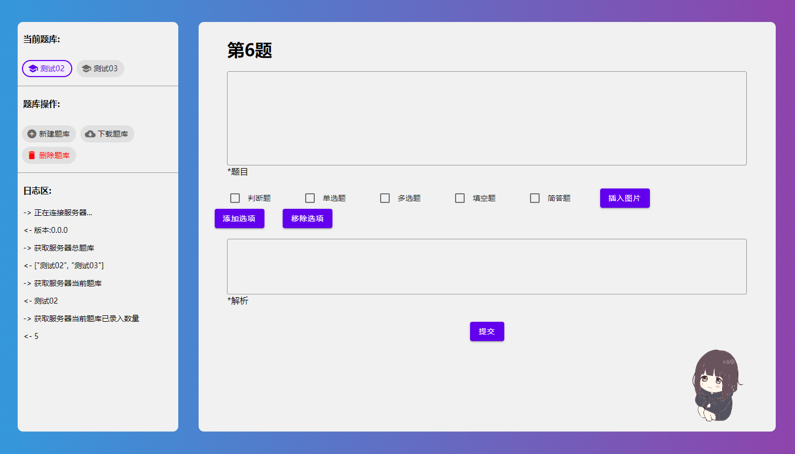

# 刷题小工坊-录题系统
> <li>多题库</li>
> <li>可视化</li>

注意:该系统制作的题库至少需要 `刷题小工坊 v0.7.0` 以上的版本。 
## 系统预览

## 安装与启动
> 方式一(Windows):

在这些页面下载最新版编译好的main.exe，放到一个干净的、单独的文件夹里面，双击运行。
根据窗口中提示的文字(如: http://127.0.0.1:5000) ,打开浏览器并输入`http://127.0.0.1:5000`,若出现系统界面则启动完成。

> 方式二(通用):

在你的设备上安装Python设置好环境变量，使用`git clone`下载项目到本地，在`cmd`中输入`Python main.py`或者Python IDE (PyCharm) 中打开项目并直接运行。然后再在浏览器中打开提示的网址。

理论上可以在任何支持Python的设备上运行,但兼容性因设备不足没有验证。

> 一些可能的问题:

`http://127.0.0.1:5000`的端口被占用等,请关闭其他本地调试进程。
## 软件更新
> 更新时覆盖旧文件即可保留上版本的题库,或者将上个版本 `Database` 复制或替换到新版本中
## 题库操作
### 新建题库
当系统没有题库、或者您需要同时导入多个题库时,请点击题库操作区域的新建按钮(新建的题库会作为当前正在使用的题库)。
### 删除题库
该操作会删除当前正在使用的题库(删除后需要手动选择或者添加题库),否则会处于无题库状态。
### 下载题库
当您确定完成题库导入的操作后,点击可以下载题库并导入到手机中进行刷题。 
注:请只有在确保导入完成时进行下载操作。

## 选项操作
### 增加题库
根据你的题目的选项来增加题库,最多 `26` 个。
### 删除题库
根据你的题目的选项来增加题库,最少 `1` 个。
## 使用图片
> 只允许在题目中插入图片,其他地方插入图片无效。

首先点击 `添加图片` ,选择需要导入的图片后服务器会返回一串代码(如: `@##RAW#example.png##@` ),请复制该代码到 `题目` 中需要的位置(如: `图@##RAW#example.png##@中包含的编程语言有:` )即可。

## 题型说明
### 判断题
>简答题没有 `选项` 。

### 简答题
>简答题没有 `选项` 与 `答案` ,将答案填写到解析处。