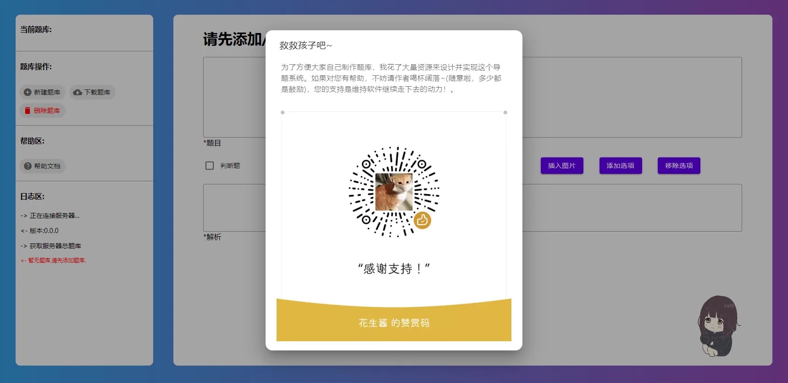
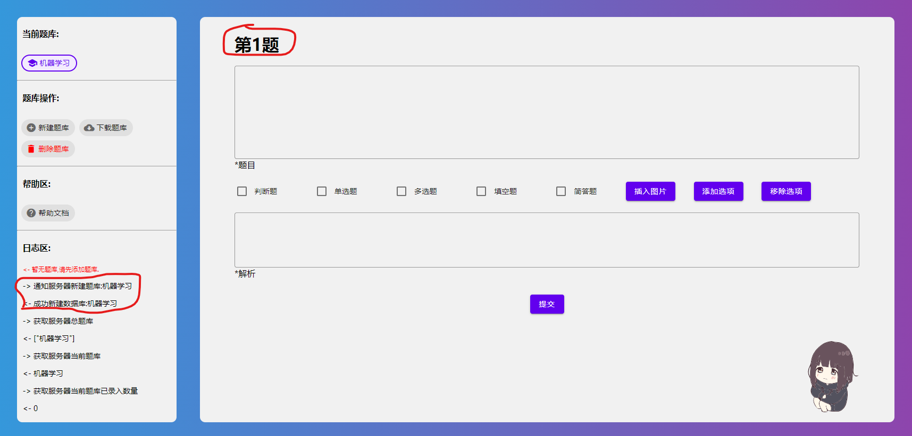

# 使用教程
> 本教程默认你已经安装好并能正确打开系统。
> 
> 由于本系统刚开发,诸多功能不完善或存在BUG,请联系群主解决。

## 检查系统是否显示正确
如下图所示的界面才是正确的界面(包含两列，一列是工作区，一列是输入区)。

如果只显示一列输入区(可能伴随着界面按钮等错位)，请* [更换浏览器](#更换浏览器)。
## 检查系统是否正常工作
点击右下角 `小人` ,看是否出现弹窗

若没有出现弹窗,请* [更换浏览器](#更换浏览器)。
## 第一次使用
第一次使用时系统是没有题库的,请点击左侧的 `新建题库`,提交后日志区会出现方框内的消息,并且输入区标题会变成第1题(表示现在可以录入第一题了)

## 非第一次使用
如果要录入到`新的不存在`的题库中,请点击左侧的 `新建题库`,提交后日志区会出现方框内的消息,并且输入区标题会变成第1题(表示现在可以录入第一题了)

如果要录入到的`新的题库已经存在`,请直接点击左侧的 `题库名字` ,成功时会高亮显示该题库。
## 录入题目
前面的步骤都完成后,接下来应该可以录入题目了。
`输入题目`、`选择题型`、`输入选项`、`勾选选项`、`输入解析`后点击下方的提交,成功时上方标题的 `第几题` 会+1
### 录入图片
大致是选择图片,日志区会返回 `@##RAW#xxx##@(xxx一般是图片名称)` ,然后将该代码插入到你想插入到的题目中间,最终结果就是代码会被替换成图片来显示(详情见[帮助文档](../static/doc/doc.000.md))。
## 下载题库
当题目全部录入完毕后,点击左侧 `下载题库` ,将下载到的 `.db` 文件发送到手机,进入到刷题小工坊,选择`设置->题库设置->选择题库`即可。
## 迁移与编辑题库
将题库放入软件目录的 `Database` 文件夹,刷新网页选中该题库即可。
## 学会观察日志区
日志区是留给用户看的,什么操作干了什么,服务器返回了什么都有说明,如果出现错误请联系群主解决。
## 更换浏览器
出现浏览器不兼容的一般是 `IE` ,推荐使用新版的 `Chrome` 内核的 `Microsoft Edge` 浏览器。
或者谷歌的 `Chrome` 浏览器，`Chrome` 内核的浏览器一般都可以。